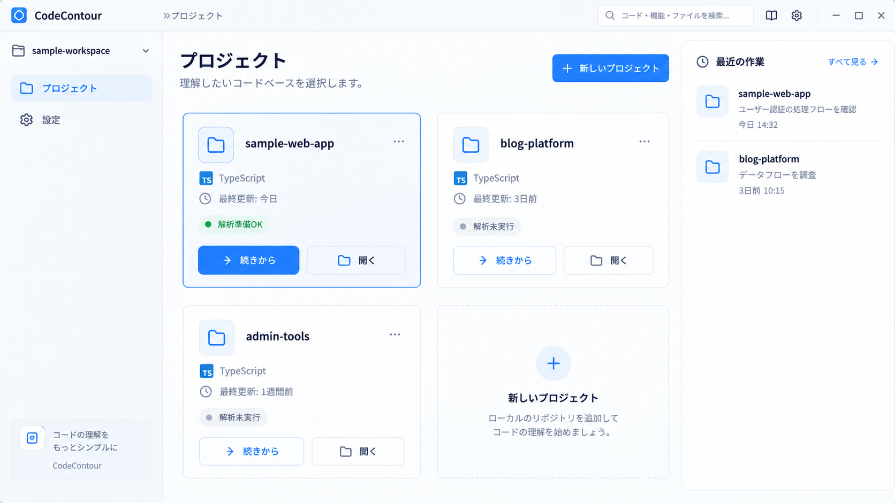
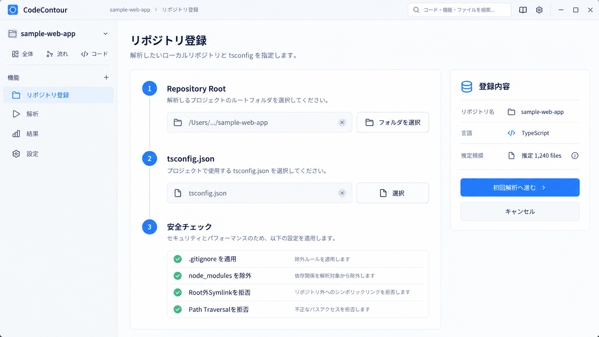
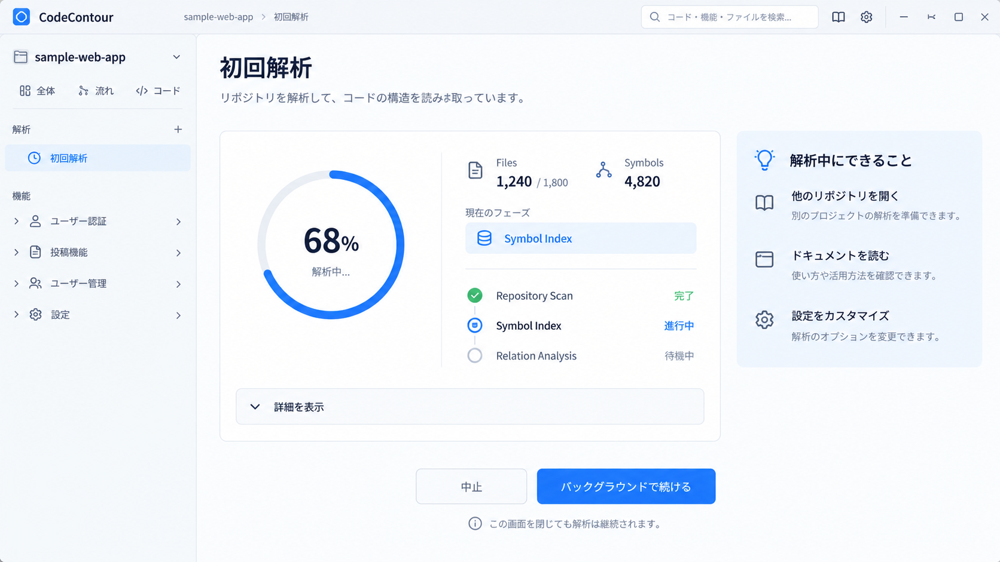
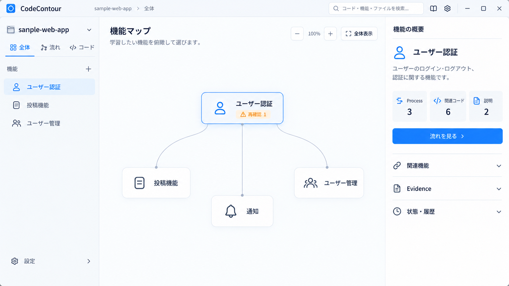
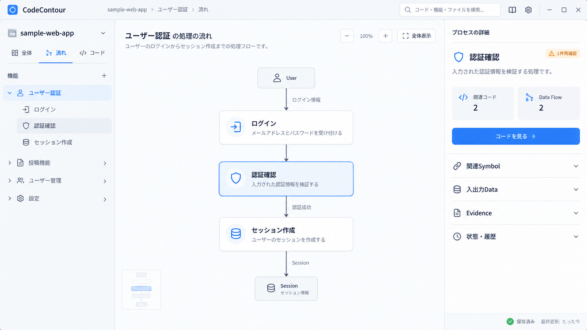
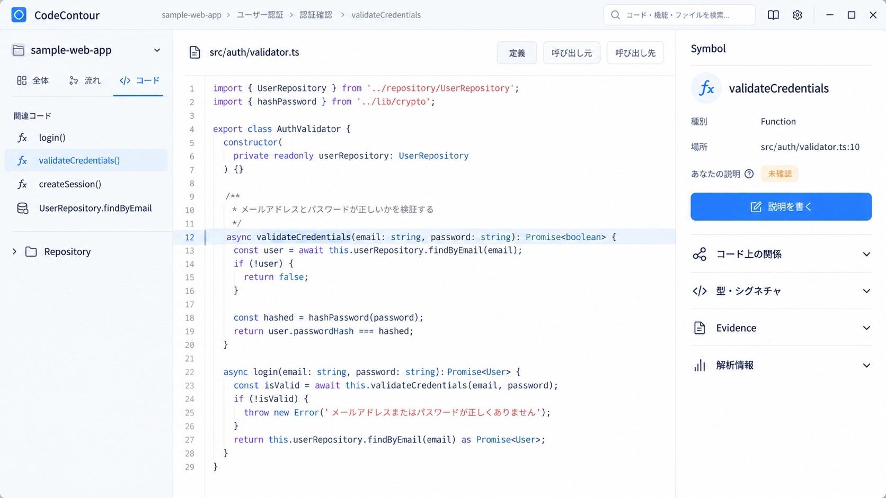
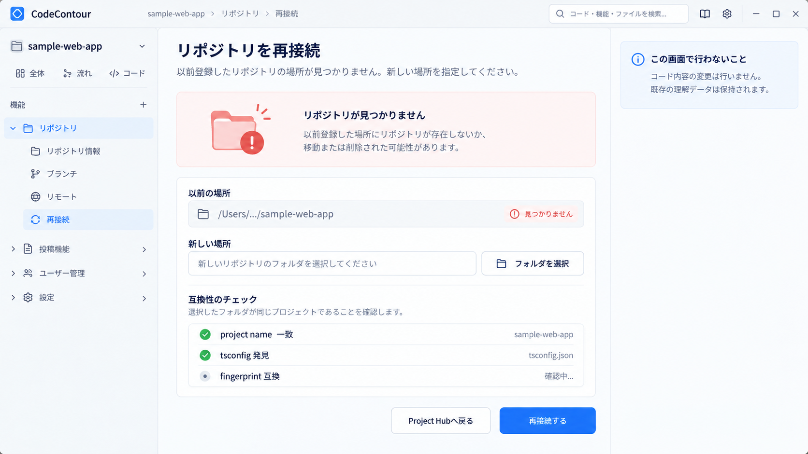
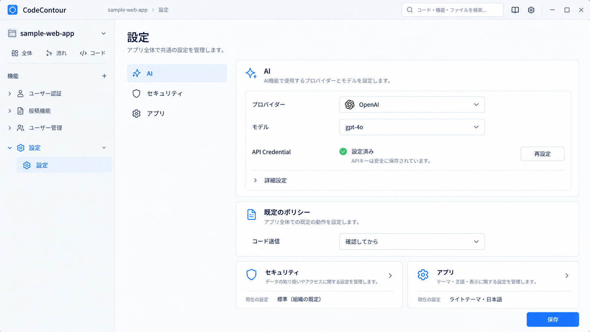
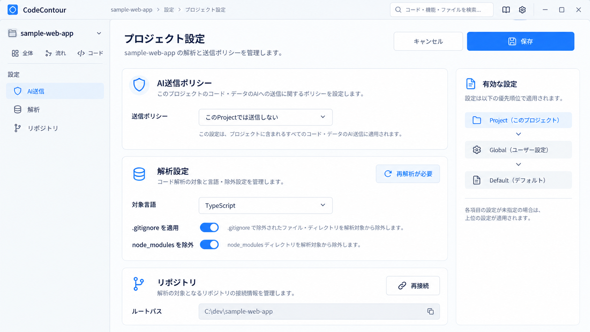

# UI Mockups

[プロジェクトREADME](../README.md) | [ドキュメント一覧](README.md) | [MVP実装境界](mvp-implementation-boundaries.md) | [User Experience](user-experience.md)

```text
Status: REFERENCE
Updated: 2026-09-18
```

> 本文書と画像は、CodeContour MVPの画面構成・情報階層・操作イメージを共有するための視覚資料である。UIの正規仕様ではない。画像と固定MVP、Screen / View / Overlay責務、Security Boundaryが矛盾する場合は、各正規仕様を優先する。

## 対応表

| Screen / View ID | 名称 | 画像 |
| --- | --- | --- |
| SCR-001 | Project Hub | [01-project-hub.png](assets/ui-mocks/01-project-hub.png) |
| SCR-002 | Repository Setup | [07-repository-setup.png](assets/ui-mocks/07-repository-setup.png) |
| SCR-003 | Initial Analysis | [03-initial-analysis.png](assets/ui-mocks/03-initial-analysis.png) |
| SCR-004 / VIEW-101 | Understanding Workspace / Feature Map | [04-feature-map.png](assets/ui-mocks/04-feature-map.png) |
| SCR-004 / VIEW-102 | Understanding Workspace / Process・Data Flow | [05-process-data-flow.png](assets/ui-mocks/05-process-data-flow.png) |
| SCR-004 / VIEW-103 | Understanding Workspace / Code Viewer | [06-code-viewer.png](assets/ui-mocks/06-code-viewer.png) |
| SCR-005 | Repository Reconnect | [09-repository-reconnect.png](assets/ui-mocks/09-repository-reconnect.png) |
| SCR-006 | Global Settings | [08-global-settings.png](assets/ui-mocks/08-global-settings.png) |
| SCR-007 | Project Settings | [02-project-settings.png](assets/ui-mocks/02-project-settings.png) |

## SCR-001 Project Hub

登録済みProject、解析状態、最近の作業、新規Project作成への入口を表示する。



## SCR-002 Repository Setup

Local Repository Rootと対象`tsconfig.json`を選択し、`.gitignore`、`node_modules`、Symlink、Path Traversalに関するSecurity Boundaryを確認する。



## SCR-003 Initial Analysis

Repository Scan、Symbol Index、Relation Analysisの進行状況と、バックグラウンド継続操作を表示する。



## SCR-004 Understanding Workspace

Understanding Workspaceは独立した複数Screenではなく、1つのScreen内で抽象度を切り替える。

### VIEW-101 Feature Map

Featureを「面」として俯瞰し、Feature間の関係、理解状態、関連Process・Source・Explanationへの入口を表示する。



### VIEW-102 Process / Data Flow

Feature内部のProcess、Process間のData Flow、入出力、Evidence、状態を「線」として表示する。



### VIEW-103 Code Viewer

SymbolとSource Codeを「点」として表示し、Definition、Caller、Callee、Type、Evidence、User Explanationへ接続する。



## SCR-005 Repository Reconnect

登録済みRepositoryが見つからない場合に新しいLocationを指定し、Project identityとfingerprintの互換性を確認して再接続する。



## SCR-006 Global Settings

AI Provider、Credential参照、既定のAI Transmission Policy、Security、Application表示設定を管理する。



## SCR-007 Project Settings

Project単位のAI Transmission Policy、解析設定、Repository Bindingを管理し、Global Defaultとの優先順位を示す。



## 実装時の注意

- 表示文言、Button位置、Icon、Pane幅は固定仕様ではない
- Verification Resultは独立ScreenではなくCode Viewer内のInspectorとして扱う
- Feature Map、Process / Data Flow、Code ViewerはSCR-004内のViewであり、独立Routeにしない
- RendererへFilesystem、SQLite、Credential、raw `ipcRenderer`を公開しない
- Source Code編集機能を提供しない
- AIはUser Explanation本文やUser Contextを直接変更しない
- Loading、Empty、Error、PARTIAL、STALE、ORPHANEDを正常状態として設計する
